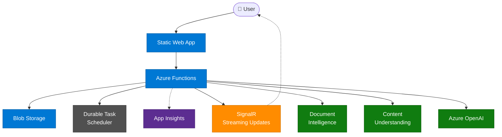

# Intelligent Document Processing (IDP) Workflow

[](https://github.com/lordlinus/idp-workflow/stargazers)
[](https://github.com/lordlinus/idp-workflow/network/members)
[](https://github.com/lordlinus/idp-workflow/issues)
[](LICENSE)
[](https://learn.microsoft.com/azure/developer/azure-developer-cli/)

End-to-end document processing pipeline on Azure — upload a PDF, get structured data back with human-in-the-loop validation and AI reasoning.

Built with **Azure Durable Functions**, **Azure Document Intelligence**, **DSPy**, and a **Next.js** real-time dashboard.

## Architecture



> **Pipeline:** Upload PDF → ① Extract → ② Classify → ③ Extract Data → ④ Compare → ⑤ Human Review → ⑥ AI Reasoning → Structured Result

## Features

- **6-step pipeline** — extraction → classification → dual AI extraction → comparison → human review → AI reasoning
- **Real-time UI** — Next.js dashboard with SignalR live updates and Reaflow workflow visualization
- **Human-in-the-Loop** — side-by-side field comparison with approve / reject / edit
- **Domain-driven** — add new document types by dropping JSON config files (no code changes)
- **Production-ready infra** — Flex Consumption Functions, Network Security Perimeter, managed identity, Application Insights

## Deploy to Azure

> **Prerequisites:** [Azure Developer CLI](https://learn.microsoft.com/azure/developer/azure-developer-cli/install-azd), [Azure Functions Core Tools v4](https://learn.microsoft.com/azure/azure-functions/functions-run-tools), [Node.js 18+](https://nodejs.org/), [Python 3.13+](https://www.python.org/), and an Azure subscription with Azure OpenAI, Document Intelligence, Content Understanding (CU), and SignalR Service already provisioned.

```bash
# Clone and initialize
azd init --template lordlinus/idp-workflow --environment <env-name>

# Set regions (SWA is limited to: centralus, eastus2, eastasia, westeurope, westus2)
azd env set AZURE_LOCATION "swedencentral"
azd env set AZURE_SWA_LOCATION "eastasia"

# Configure external service connections
azd env set AZURE_SIGNALR_CONNECTION_STRING "<value>"
azd env set AZURE_DOCUMENT_INTELLIGENCE_ENDPOINT "<value>"
azd env set AZURE_DOCUMENT_INTELLIGENCE_KEY "<value>"
azd env set COGNITIVE_SERVICES_ENDPOINT "<value>"
azd env set COGNITIVE_SERVICES_KEY "<value>"
azd env set AZURE_OPENAI_ENDPOINT "<your-endpoint-or-apim-gateway-url>"
azd env set AZURE_OPENAI_KEY "<your-key-or-apim-subscription-key>"
azd env set AZURE_OPENAI_CHAT_DEPLOYMENT_NAME "gpt-4.1"
azd env set AZURE_OPENAI_REASONING_DEPLOYMENT_NAME "o3-mini"
azd env set AZURE_OPENAI_API_VERSION "2025-01-01-preview"
azd env set TASKHUB_NAME "idpworkflow"

# Provision and deploy (~15-20 min)
azd up
```

<details>
<summary>What gets deployed</summary>

| Resource | Purpose |
|----------|---------|
| Azure Functions (Flex Consumption) | Backend API + orchestration |
| Azure Static Web App | Next.js frontend |
| Durable Task Scheduler | Orchestration state management |
| Storage Account | Blob storage for documents |
| Application Insights | Monitoring and diagnostics |
| User-Assigned Managed Identity | Passwordless DTS authentication |
| Network Security Perimeter | Storage network lockdown |

The `postdeploy` hook automatically uploads sample documents, locks down storage networking (NSP → Enforced), and grants your identity access to the [DTS dashboard](https://dashboard.durabletask.io/).

</details>

To tear down all resources:

```bash
azd down --purge
```

## Run Locally

```bash
# DTS Emulator (requires Docker)
docker run -d -p 8080:8080 -p 8082:8082 \
  -e DTS_TASK_HUB_NAMES=default,idpworkflow \
  mcr.microsoft.com/dts/dts-emulator:latest

# Backend (Terminal 1)
python -m venv .venv && source .venv/bin/activate
pip install -r requirements.txt
func start

# Frontend (Terminal 2)
cd frontend && npm install && npm run dev
```

Open <http://localhost:3000> and upload a PDF from `sample_documents/`.

See [Local Development Guide](docs/local-development.md) for full environment setup including `local.settings.json` configuration.

## How It Works

```
POST /api/idp/start
 → Step 1  PDF Extraction        (Azure Document Intelligence → Markdown)
 → Step 2  Classification        (DSPy ChainOfThought)
 → Step 3  Data Extraction       (Azure CU + DSPy, run in parallel)
 → Step 4  Comparison            (field-by-field diff)
 → Step 5  Human Review          (HITL — waits for approval or timeout)
 → Step 6  AI Reasoning Agent    (validation, summary, recommendations)
 → Final result returned
```

Each step broadcasts `stepStarted` / `stepCompleted` events via SignalR so the frontend updates in real time.

## Documentation

| Document | Description |
|----------|-------------|
| [Architecture & Patterns](docs/architecture.md) | Deep dive into backend/frontend patterns, project structure, and how to extend the pipeline |
| [Local Development](docs/local-development.md) | Environment variables, DTS emulator, running backend + frontend locally |

## Tech Stack

| Layer | Technologies |
|-------|-------------|
| **Frontend** | Next.js 14, TypeScript, Tailwind CSS, Zustand + Immer, React Query, SignalR, Reaflow |
| **Backend** | Python 3.13, Azure Functions, Durable Functions, DSPy, Azure Document Intelligence, Azure OpenAI |
| **Infra** | Bicep, azd, Flex Consumption, Durable Task Scheduler, Network Security Perimeter |

## Contributing

1. Follow the existing code structure and [architecture patterns](docs/architecture.md)
2. Add tests for new features
3. Update documentation
4. Submit pull requests for review

## License

[MIT](LICENSE)

## Support

- [Open an issue](https://github.com/lordlinus/idp-workflow/issues) on GitHub
- Review logs in Application Insights
- Access the [DTS dashboard](https://dashboard.durabletask.io/) for orchestration debugging
