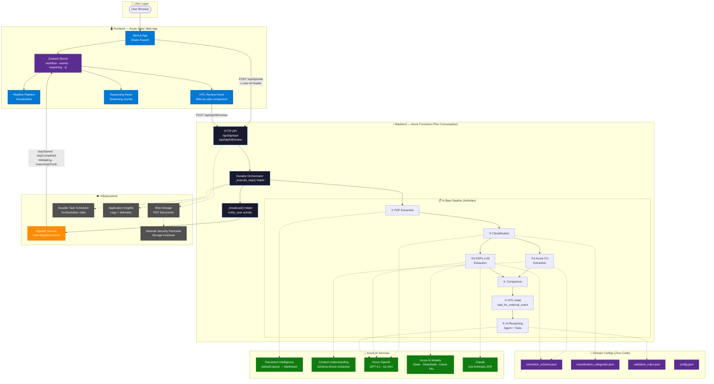
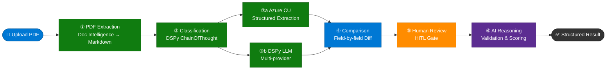

# Architecture & Patterns

Deep-dive reference for contributors and anyone extending the DocProcessIQ pipeline.

> **Looking for the quick-start?** See the [main README](../README.md).

---

## Table of Contents

- [System Design](#system-design)
- [Pipeline Flow](#pipeline-flow)
- [Project Structure](#project-structure)
- [Backend Patterns](#backend-patterns)
- [Frontend Patterns](#frontend-patterns)
- [Infrastructure (Bicep)](#infrastructure-bicep)
- [Adding a New Pipeline Step](#adding-a-new-pipeline-step)
- [API Reference](#api-reference)
- [Domain Configuration](#domain-configuration)
- [Monitoring](#monitoring)
- [Testing](#testing)

---

## System Design



### Key Design Decisions

| Decision | Rationale |
|----------|-----------|
| **Durable Functions orchestrator** | Native checkpointing, external event gates, timer races, parallel fan-out/fan-in — no external queue or state DB needed |
| **Dual-model extraction (Step 3)** | Cross-validation: agreement = high confidence, disagreement = focused human review |
| **SignalR user-targeted messaging** | Frontend generates session `userId`, sent via `x-user-id` header at negotiate time — no pub/sub management |
| **Domain configs as JSON** | New document types require zero code changes — extraction schema drives both Azure CU analyzer and DSPy Pydantic model generation |
| **Static Web App export** | Next.js `output: 'export'` produces static HTML/JS — deployed to Azure SWA with zero server-side runtime |

---

## Pipeline Flow



```
HTTP POST /api/idp/start
  → Orchestrator (idp_workflow/orchestration/orchestration.py)
    → Step 1: PDF Extraction        (Azure Document Intelligence → Markdown)
    → Step 2: Classification        (DSPy ChainOfThought)
    → Step 3: Data Extraction       (Azure CU + DSPy, run concurrently)
    → Step 4: Comparison            (Azure vs DSPy field-by-field)
    → Step 5: Human Review          (HITL gate — waits for external event or timeout)
    → Step 6: AI Reasoning Agent    (validation, summary, recommendations)
  → Final result returned
```

Each step broadcasts `stepStarted` → `stepCompleted` / `stepFailed` events via SignalR so the frontend can update in real time.

---

## Project Structure

```
├── function_app.py              # Azure Functions entry point — registers activities, orchestration, endpoints
├── requirements.txt             # Python dependencies
├── host.json                    # Azure Functions configuration
├── local.settings.json          # Local environment variables
├── azure.yaml                   # Azure Developer CLI configuration
│
├── frontend/                    # Next.js 14 Frontend
│   ├── src/
│   │   ├── app/                # Pages and layout
│   │   ├── components/         # React components
│   │   │   ├── FileUploadArea.tsx
│   │   │   ├── WorkflowDiagram.tsx   (Reaflow visualization)
│   │   │   ├── HITLReviewPanel.tsx
│   │   │   ├── ReasoningPanel.tsx
│   │   │   └── detail/              # Split DetailPanel components
│   │   │       ├── StepOutputRenderer.tsx
│   │   │       ├── StepOutputView.tsx
│   │   │       ├── ReasoningOutput.tsx
│   │   │       ├── CompletionDashboard.tsx
│   │   │       ├── ValidationRulesPanel.tsx
│   │   │       ├── ExtractionSchemaView.tsx
│   │   │       ├── DefaultView.tsx
│   │   │       └── ValueDisplay.tsx
│   │   ├── lib/
│   │   │   ├── apiClient.ts          # Axios singleton
│   │   │   ├── signalrClient.ts      # Auto-reconnect with exponential backoff
│   │   │   ├── stepConfig.ts         # Centralized step metadata (single source of truth)
│   │   │   ├── formatting.ts         # formatFieldValue, getConfidenceColor
│   │   │   └── queryKeys.ts
│   │   ├── store/                    # Zustand stores (workflowStore, eventsStore, reasoningStore, uiStore)
│   │   └── types/                    # TypeScript types
│   └── package.json
│
├── infra/                       # Infrastructure as Code (Bicep)
│   ├── main.bicep              # Subscription-level template
│   ├── core.bicep              # Core resource definitions (RBAC loop)
│   └── main.parameters.json   # Parameter values
│
├── sample_documents/            # Sample PDFs for testing
│
└── idp_workflow/                # Main workflow package
    ├── constants.py             # Step registry (STEPS tuple — single source of truth)
    ├── config.py                # Settings management (all env vars)
    ├── models.py                # Pydantic data models
    ├── errors.py                # Typed error hierarchy (IDPError base)
    ├── activities/
    │   ├── activities.py        # Activity functions (one per step)
    │   ├── signalr.py           # SignalR output binding + notify_user activity
    │   └── utils.py             # ActivityContext helper (timing, logging, result formatting)
    ├── orchestration/
    │   └── orchestration.py     # Durable orchestrator + _execute_step() helper
    ├── api/
    │   └── endpoints.py         # HTTP + SignalR endpoints
    ├── steps/
    │   ├── step_01_pdf_extractor.py
    │   ├── step_02_classifier.py
    │   ├── step_03_extractors.py
    │   ├── step_04_comparator.py
    │   └── step_06_reasoning_agent.py
    ├── domains/                 # Domain-specific configs (JSON)
    │   ├── domain_loader.py     # LRU-cached domain config loader
    │   ├── home_loan/
    │   ├── insurance_claims/
    │   ├── small_business_lending/
    │   └── trade_finance/
    ├── tools/
    │   ├── content_understanding_tool.py   # Azure CU REST wrapper
    │   ├── dspy_utils.py                   # Dynamic Pydantic model generation
    │   └── llm_factory.py                  # LLM client factory
    └── utils/
        └── helpers.py           # Shared helper functions
```

---

## Backend Patterns

### Step Registry

`idp_workflow/constants.py` defines a `STEPS` tuple of `StepInfo` namedtuples as the **single source of truth** for all pipeline steps:

```python
class StepInfo(NamedTuple):
    step_id: str
    display_name: str
    step_number: int
    activity_name: str

STEPS: tuple[StepInfo, ...] = (
    StepInfo("step_01_pdf_extraction", "PDF to Markdown", 1, "activity_step_01_pdf_extraction"),
    StepInfo("step_02_classification", "Document Classification", 2, "activity_step_02_classification"),
    # ...
)
```

A derived `STEP_META` dict provides fast lookup by `step_id`. Individual constants (`STEP1_PDF_EXTRACTION`, etc.) still exist for backward compatibility.

### ActivityContext

`idp_workflow/activities/utils.py` provides an `ActivityContext` helper that standardizes:

- **Request-ID extraction** from the input dict
- **Elapsed time measurement** via `ctx.elapsed_ms`
- **Structured logging** via `ctx.log_start()` / `ctx.log_complete()` / `ctx.log_error()`
- **Result formatting** via `ctx.result()`

Every activity follows this pattern:

```python
@app.activity_trigger(input_name="request")
async def activity_step_XX(request: dict) -> dict:
    ctx = ActivityContext(request, "Step label")
    ctx.log_start()
    try:
        result, output = await executor.method(...)
        ctx.log_complete()
        return ctx.result(extraction_result=result.model_dump(), step_output=output)
    except Exception as e:
        ctx.log_error(e)
        raise ExtractionError(str(e), request_id=ctx.request_id, step_name="step_XX") from e
```

### Orchestrator Helper

The `_execute_step()` generator in `orchestration.py` wraps the broadcast → activity → broadcast pattern. Simple steps become a one-liner:

```python
step1_result = yield from _execute_step(
    context, user_id, request_id,
    STEP1_PDF_EXTRACTION, "activity_step_01_pdf_extraction",
    {"request_id": request_id, "pdf_path": pdf_path}
)
```

This reduces ~40 lines of boilerplate per step to ~5. Step 3 (parallel Azure CU + DSPy) uses `context.task_all()` and Step 5 (HITL gate) uses `wait_for_external_event()` with a timer race — both require custom orchestration logic.

### Typed Errors

`idp_workflow/errors.py` defines a hierarchy:

```
IDPError (base)
├── ExtractionError      (Steps 1, 3)
├── ClassificationError  (Step 2)
├── ComparisonError      (Step 4)
├── ReasoningError       (Step 6)
└── ConfigurationError   (missing env vars, invalid domain config)
```

All carry `request_id` and `step_name` for structured error handling. Never raise bare `Exception` from activities.

### SignalR User-Targeted Messaging

The orchestrator broadcasts state changes via a `_broadcast()` helper that calls a `notify_user` activity with a SignalR output binding. Messages are targeted to specific users via `userId` (not groups).

The frontend generates a session-scoped `userId`, sends it as an `x-user-id` header on negotiate and start-workflow requests. The negotiate binding uses `user_id="{headers.x-user-id}"` to tie the SignalR token to that user. No subscribe/unsubscribe endpoints are needed. All events include `instanceId` and `timestamp`.

### Async Patterns

- Blocking DSPy / Azure SDK calls are wrapped with `loop.run_in_executor()`
- Concurrent page processing uses `asyncio.Semaphore` (default limit: 5)
- DSPy calls use `with dspy.context(lm=self.lm):` for LM scoping

---

## Frontend Patterns

### Centralized Step Config

`frontend/src/lib/stepConfig.ts` consolidates all step metadata into one file:

- Display names, order, step numbers
- Icons and descriptions
- Pipeline layout rows for the Reaflow diagram

Exports: `STEP_CONFIGS`, `STEP_ORDER`, `STEP_DISPLAY_NAMES`, `STEP_INFO`, `STEP_NUM_TO_NAMES`, `PIPELINE_ROWS`, `TOTAL_STEPS`.

**Never hardcode step names, icons, or display order in components** — always import from `stepConfig.ts`.

### State Management

Four Zustand stores with Immer middleware:

| Store | Purpose |
|-------|---------|
| `workflowStore` | Step states, HITL status, workflow progress |
| `eventsStore` | SignalR event log |
| `reasoningStore` | Streaming reasoning chunks |
| `uiStore` | Connection status, toasts |

### Split DetailPanel

The detail panel is decomposed into `frontend/src/components/detail/`:

| Component | Responsibility |
|-----------|---------------|
| `StepOutputRenderer` | Dispatch to the correct renderer by step name |
| `StepOutputView` | Generic step output display |
| `ReasoningOutput` | Streaming AI reasoning with chunk-type formatting |
| `CompletionDashboard` | Final workflow summary |
| `ValidationRulesPanel` | Domain validation rules display |
| `ExtractionSchemaView` | Domain extraction schema display |
| `DefaultView` | Fallback for unknown steps |
| `ValueDisplay` | Formatted field value rendering |

Shared formatting helpers (`formatFieldValue`, `getConfidenceColor`) live in `frontend/src/lib/formatting.ts`.

### Data Fetching

React Query hooks in the components layer:

- `useUploadPDF` — upload a document to blob storage
- `useStartWorkflow` — trigger the orchestration
- `useDemoDocument` — load a pre-uploaded sample

API client (`apiClient.ts`) is an Axios singleton. SignalR client (`signalrClient.ts`) auto-reconnects with exponential backoff.

---

## Infrastructure (Bicep)

### Resource Overview

| Resource | Module | Notes |
|----------|--------|-------|
| Function App (Flex Consumption) | `core.bicep` | FC1 SKU, Python 3.11 |
| Static Web App | `core.bicep` | Standard tier |
| Durable Task Scheduler | `core.bicep` | With task hub |
| Storage Account | `core.bicep` | Standard_LRS |
| Application Insights | `core.bicep` | Linked to Log Analytics |
| Log Analytics Workspace | `core.bicep` | 30-day retention |
| User-Assigned Managed Identity | `core.bicep` | For DTS authentication |
| Network Security Perimeter | `core.bicep` | Deployed in Learning mode |

### Key Patterns

- **RBAC loop**: 5 storage role assignments consolidated into a single Bicep loop over a role-ID array
- **Parameterized values**: `logAnalyticsRetentionDays` (30), `storageAccountSkuName` (`Standard_LRS`), `functionAppMaxInstances` (100), `functionAppInstanceMemoryMB` (2048)
- **Two-region deployment**: `location` for Functions / Storage / DTS, `staticWebAppLocation` for SWA (limited availability)
- **NSP lifecycle**: Deployed in `Learning` mode → switched to `Enforced` by `postdeploy` hook after sample documents are uploaded

---

## Adding a New Pipeline Step

Follow this 6-file checklist to wire up a new step end-to-end.

### Backend (4 files)

**1. Register in `idp_workflow/constants.py`**

Append a `StepInfo` to the `STEPS` tuple and add a backward-compat constant:

```python
STEPS: tuple[StepInfo, ...] = (
    ...
    StepInfo("step_07_my_step", "My Step", 7, "activity_step_07_my_step"),
)

STEP7_MY_STEP = "step_07_my_step"
```

**2. Create step logic in `idp_workflow/steps/step_07_my_step.py`**

Implement an async method returning `(PydanticModel, step_output_dict)`:

```python
class MyStepExecutor:
    async def execute(self, ...) -> tuple[MyModel, dict]:
        # ... do work ...
        return result, {"summary_field": value}
```

**3. Add activity in `idp_workflow/activities/activities.py`**

Use `ActivityContext` for logging/timing:

```python
@app.activity_trigger(input_name="request")
async def activity_step_07_my_step(request: dict) -> dict:
    ctx = ActivityContext(request, "My step")
    try:
        ctx.log_start()
        # ... call step logic ...
        ctx.log_complete(f"done in {ctx.elapsed_ms}ms")
        return {"extraction_result": result.model_dump(), "step_output": output}
    except Exception:
        ctx.log_error()
        raise
```

**4. Add to orchestrator in `idp_workflow/orchestration/orchestration.py`**

Use `_execute_step()`:

```python
step7_result = yield from _execute_step(
    context, user_id, request_id,
    STEP7_MY_STEP, "activity_step_07_my_step",
    {"request_id": request_id, "some_input": value},
)
```

### Frontend (2 files)

**5. Add step config in `frontend/src/lib/stepConfig.ts`**

Append to `STEP_CONFIGS` and add to the `StepName` union type in `frontend/src/types/`:

```typescript
{
  name: 'step_07_my_step',
  number: 7,
  displayName: 'My Step',
  fullDisplayName: 'My Step',
  description: 'What this step does',
  icon: '🔧',
},
```

**6. Add output renderer in `frontend/src/components/detail/StepOutputRenderer.tsx`**

Add a branch in `StepOutputRenderer`:

```tsx
if (stepName === 'step_07_my_step') {
  return <MyStepOutput output={output} />;
}
```

Steps without a dedicated renderer automatically use `GenericOutput` (key-value display).

### Optional

- **Pydantic model** in `idp_workflow/models.py` for typed step output
- **Error class** in `idp_workflow/errors.py` inheriting from `IDPError`
- **Domain configs** in `idp_workflow/domains/<domain>/` if the step uses domain-specific settings

---

## API Reference

### HTTP Endpoints

| Method | Endpoint | Description |
|--------|----------|-------------|
| `POST` | `/api/idp/start` | Start a new workflow |
| `POST` | `/api/idp/hitl/review/{instanceId}` | Submit human review decision |

### SignalR Endpoints

| Method | Endpoint | Description |
|--------|----------|-------------|
| `GET/POST` | `/api/idp/signalr-connect` | SignalR connection info (renamed from "negotiate" to avoid SWA interception) |
| `POST` | `/api/idp/subscribe/{instanceId}` | Subscribe to workflow updates |
| `POST` | `/api/idp/unsubscribe/{instanceId}` | Unsubscribe from updates |

### Real-time Events

| Event | Description |
|-------|-------------|
| `stepStarted` | Step begins execution |
| `stepCompleted` | Step completes successfully |
| `stepFailed` | Step encounters an error |
| `hitlWaiting` | Waiting for human review |
| `reasoningChunk` | Streaming reasoning output |
| `workflowCompleted` | Workflow finishes |

---

## Domain Configuration

Each domain has its own folder under `idp_workflow/domains/`:

```
idp_workflow/domains/<domain_name>/
├── config.json                      # Domain settings
├── classification_categories.json   # Document categories
├── extraction_schema.json           # Data extraction schema
└── validation_rules.json            # Validation rules
```

**To add a new domain:** create a new folder with the four JSON files. The domain is automatically loaded via `domain_loader.py` (LRU-cached).

The DSPy extractor dynamically generates Pydantic models from `extraction_schema.json` at runtime using `create_extraction_model_from_schema()`. No code changes required.

Available domains: `home_loan`, `insurance_claims`, `small_business_lending`, `trade_finance`.

---

## Monitoring

| Tool | What it provides |
|------|-----------------|
| **Application Insights** | Logs, telemetry, distributed tracing |
| **SignalR Events** | Real-time step progress in the frontend |
| **Function Logs** | Detailed execution traces per activity |
| **DTS Dashboard** | Orchestration instance status at [dashboard.durabletask.io](https://dashboard.durabletask.io/) |

---

## Testing

Test the API using curl or the VS Code REST Client (`tests/demo.http`):

```bash
# Start workflow
curl -X POST http://localhost:7071/api/idp/start \
  -H "Content-Type: application/json" \
  -d '{
    "pdf_path": "/path/to/document.pdf",
    "domain_id": "insurance_claims",
    "max_pages": 50
  }'

# Submit review
curl -X POST http://localhost:7071/api/idp/hitl/review/{instanceId} \
  -H "Content-Type: application/json" \
  -d '{
    "approved": true,
    "reviewer": "user@example.com",
    "feedback": "Looks good"
  }'
```
